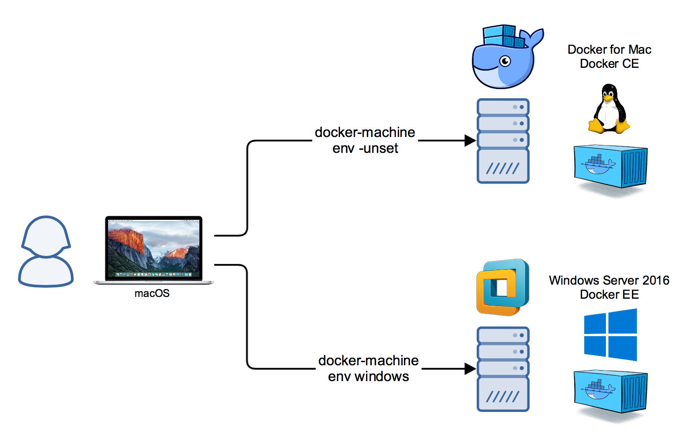
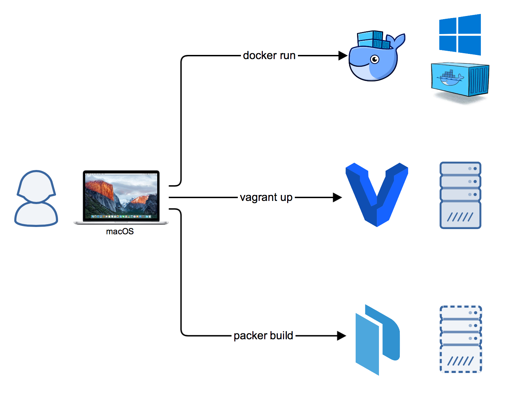

# Windows Docker Machine

This Vagrant environment creates a Docker Machine to work on your MacBook
with Windows containers. You can easily switch between Docker for Mac Linux containers and the Windows containers.



Tested environments
  * macOS with Vagrant 1.9.2
    * VMware Fusion Pro 8.5.3
    * VirtualBox 5.1.12
  * Windows with Vagrant 1.9.2
    * VMware Workstation Pro 12.5.2
    * (VirtualBox see issue [#2](https://github.com/StefanScherer/windows-docker-machine/issues/2))
    * (Hyper-V see issue [#1](https://github.com/StefanScherer/windows-docker-machine/issues/1))

#### Before you begin

First you need the Windows Server 2016 VM for your hypervisor. I prefer "Infrastructure as Code", so every build step is available on GitHub.



1. **packer build** to build a Vagrant base box, it's like a Docker image, but for Vagrant VM's
2. **vagrant up** to create a running VM instance of Windows Server 2016
3. **docker run** to run Windows containers in that Windows VM

Step 1 can be done with these steps:

```bash
$ git clone https://github.com/StefanScherer/packer-windows
$ cd packer-windows
$ packer build --only=vmware-iso windows_2016_docker.json
$ vagrant box add windows_2016_docker windows_2016_docker_vmware.box
```

## Working on macOS
### Create the Docker Machine

Spin up the headless Vagrant box with Windows Server 2016 and Docker EE installed.
It will create the TLS certs and create a `windows` Docker machine for your
`docker-machine` binary on your Mac.

```bash
$ vagrant up --provider vmware_fusion
$ vagrant up --provider virtualbox
```


### List your new Docker machine

```bash
$ docker-machine ls
NAME      ACTIVE   DRIVER         STATE     URL                          SWARM   DOCKER    ERRORS
dev       -        virtualbox     Running   tcp://192.168.99.100:2376            v1.13.0   
linux     -        vmwarefusion   Running                                        Unknown
windows   *        generic        Running   tcp://192.168.254.135:2376           Unknown   
```

Currently there is [an issue](https://github.com/docker/machine/issues/3943) that the client API version of `docker-machine` is too old. But switch Docker environments works as shown below.

### Switch to Windows containers

```bash
$ eval $(docker-machine env windows)
```

Now your Mac Docker client talks to the Windows Docker engine:

```bash
$ docker version
Client:
 Version:      17.03.0-ce
 API version:  1.26
 Go version:   go1.7.5
 Git commit:   60ccb22
 Built:        Thu Feb 23 10:40:59 2017
 OS/Arch:      darwin/amd64

Server:
 Version:      17.03.0-ee-1
 API version:  1.26 (minimum version 1.24)
 Go version:   go1.7.5
 Git commit:   9094a76
 Built:        Wed Mar  1 00:49:51 2017
 OS/Arch:      windows/amd64
 Experimental: true
```

### Switch back to Docker for Mac

```bash
$ eval $(docker-machine env -unset)
```

This removes all DOCKER environment variables and you can use your Docker for Mac installation.

```bash
$ docker version
Client:
 Version:      17.03.0-ce
 API version:  1.26
 Go version:   go1.7.5
 Git commit:   60ccb22
 Built:        Thu Feb 23 10:40:59 2017
 OS/Arch:      darwin/amd64

Server:
 Version:      17.03.0-ce
 API version:  1.26 (minimum version 1.12)
 Go version:   go1.7.5
 Git commit:   3a232c8
 Built:        Tue Feb 28 07:52:04 2017
 OS/Arch:      linux/amd64
 Experimental: true
```

### Mounting volumes from your Mac machine

Just use `C:$(pwd)` to prepend a drive letter.

```bash
$ docker run -it -v C:$(pwd):C:$(pwd) microsoft/windowsservercore powershell
```

Yes, this mounts the current directory through the Windows 2016 VM into the Windows Container.

## Working on Windows

Spin up the headless Vagrant box with Windows Server 2016 and Docker EE installed.
It will create the TLS certs and create a `windows` Docker machine for your
`docker-machine` binary on your Windows host.

If you haven't worked with `docker-machine` yet, create the `.docker` directory in your user profile manually.

```powershell
PS C:\> mkdir $env:USERPROFILE\.docker
```

### Create the Docker Machine

Choose your hypervisor and start the VM

```powershell
PS C:\> vagrant up --provider vmware_workstation
PS C:\> vagrant up --provider virtualbox
PS C:\> vagrant up --provider hyperv
```

Notice: The provider `hyperv` does mount the volumes with SMB into the Win2016 VM. It seems that there is a problem mounting that further into a Windows container. The provisioning (creating the TLS certs and copying them back to the Windows host) will fail.

### List your new Docker machine

```powershell
PS C:\> docker-machine ls
NAME      ACTIVE   DRIVER         STATE     URL                          SWARM   DOCKER    ERRORS
dev       -        virtualbox     Running   tcp://192.168.99.100:2376            v1.13.0
windows   *        generic        Running   tcp://192.168.254.135:2376           Unknown   
```

### Switch to Windows containers

```powershell
PS C:\> docker-machine env windows | iex
```

Now your Windows Docker client talks to the Windows Docker engine:

```powershell
PS C:\> docker version
Client:
 Version:      17.03.0-ce
 API version:  1.26
 Go version:   go1.7.5
 Git commit:   60ccb22
 Built:        Thu Feb 23 10:40:59 2017
 OS/Arch:      windows/amd64

Server:
 Version:      17.03.0-ee-1
 API version:  1.26 (minimum version 1.24)
 Go version:   go1.7.5
 Git commit:   9094a76
 Built:        Wed Mar  1 00:49:51 2017
 OS/Arch:      windows/amd64
 Experimental: true
```

### Switch to back to Docker for Windows

```powershell
PS C:\> docker-machine env -unset | iex
```

This removes all DOCKER environment variables and you can use your Docker for Windows installation.

```powershell
PS C:\> docker version
Client:
 Version:      17.03.0-ce
 API version:  1.26
 Go version:   go1.7.5
 Git commit:   60ccb22
 Built:        Thu Feb 23 10:40:59 2017
 OS/Arch:      windows/amd64

Server:
 Version:      17.03.0-ce
 API version:  1.26 (minimum version 1.12)
 Go version:   go1.7.5
 Git commit:   3a232c8
 Built:        Tue Feb 28 07:52:04 2017
 OS/Arch:      linux/amd64
 Experimental: true
```

### Mounting volumes from your Windows machine

Just use `$(pwd)` in PowerShell.

```bash
$ docker run -it -v "$(pwd):$(pwd)" microsoft/windowsservercore powershell
```

Yes, this mounts the current directory through the Windows 2016 VM into the Windows Container.

## Further commands

Here is a list of `docker-machine` commands and the equivalent Vagrant command.

| Docker-machine command | Vagrant equivalent |
|---------|-------|
| `docker-machine create -d xxx windows` | `vagrant up --provider xxx`
| `docker-machine regenerate-certs` | `vagrant provision` |
| `docker-machine stop windows` | `vagrant halt`
| `docker-machine start windows` | `vagrant up`
| `docker-machine ssh windows` | `vagrant rdp`
| `docker-machine rm windows` | `vagrant destroy` |
